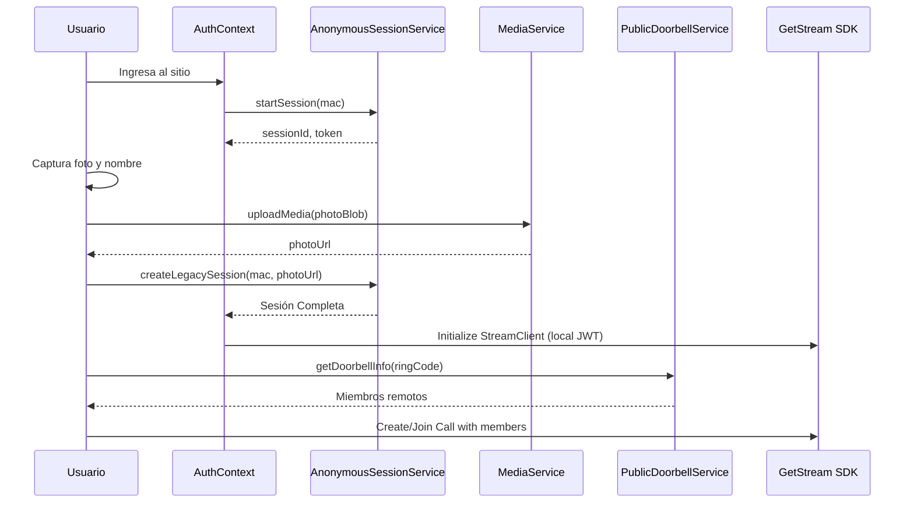

# Quiet Ring Web App

Quiet Ring es una aplicación web moderna y premium para videollamadas anónimas, diseñada con un enfoque orientado a dispositivos móviles y una estética de alta fidelidad.

## 🌟 Características Principales

- **Sesiones Anónimas**: Sin necesidad de registro tradicional, basado en identidad de dispositivo.
- **Experiencia Premium**: Diseño minimalista, animaciones suaves con Framer Motion y tipografía elegante (Sora).
- **Optimización de Video**: Relación de aspecto vertical (9:16) nativa para una sensación de aplicación móvil en el navegador.
- **Llamadas Seguras**: Integración robusta con GetStream Video SDK con generación local de tokens.

---

## 🏗️ Arquitectura y Flujo de Usuario

El siguiente diagrama muestra cómo interactúan los componentes principales del sistema durante el proceso de registro e inicio de llamada:



---

## 🛠️ Stack Tecnológico

- **Frontend**: [React](https://reactjs.org/) + [TypeScript](https://www.typescriptlang.org/)
- **Bundler**: [Vite](https://vitejs.dev/)
- **Estilos**: [Tailwind CSS](https://tailwindcss.com/)
- **Animaciones**: [Framer Motion](https://www.framer.com/motion/)
- **Video & Audio**: [GetStream Video SDK](https://getstream.io/video/docs/sdk/react/)
- **Iconos**: [Lucide React](https://lucide.dev/)
- **Comunicación HTTP**: [Axios](https://axios-http.com/)

---

## 📂 Estructura del Proyecto

```text
src/
├── api/            # Configuración de Axios y cliente API
├── components/     # Componentes visuales (Lobby, CallScreen, Registration)
├── contexts/       # AuthContext para gestión de estado global
├── services/       # Lógica de comunicación con servicios backend
│   ├── AnonymousSessionService.ts
│   ├── MediaService.ts
│   ├── PublicDoorbellService.ts
│   └── AuthService.ts (GetStream)
├── utils/          # Utilidades (Generador de JWT, UUID, etc.)
└── App.tsx         # Punto de entrada y Router
```

---

## 🔐 Servicios Detallados

### AnonymousSessionService
Gestiona el ciclo de vida de la sesión del usuario.
- `startSession(mac)`: Inicializa la identidad del dispositivo.
- `createLegacySession(mac, imgUrl)`: Vincula el perfil del usuario con su foto.
- `updateSessionPhoto(sessionId, imgUrl)`: Permite actualizar la imagen de perfil.

### MediaService
Maneja la carga y descarga de archivos multimedia.
- `uploadMedia(file)`: Sube imágenes al servidor utilizando `FormData` y metadatos JSON.
- `getFile(fileId)`: Recupera archivos en formato `Blob`.

### PublicDoorbellService
Obtiene información sobre el "timbre" (doorbell) activo.
- `getDoorbellInfo(code)`: Extrae los IDs de los miembros que deben estar presentes en la llamada de Stream basándose en un código de acceso único.

---

## 🚪 Experiencia del Lobby (`LobbyScreen`)

Antes de unirse a una llamada, los usuarios pasan por un **Lobby (Sala de Espera)** para configurar sus dispositivos.

- **`VideoPreview`**: Proporciona una vista previa local para que el usuario verifique su cámara.
- **Gestión de Dispositivos**: Los usuarios pueden alternar el estado de su micrófono y cámara antes de unirse.
- **Optimización Móvil**: El lobby aplica automáticamente restricciones de retrato (relación de aspecto `9:16`) a la señal de la cámara para garantizar una experiencia premium en móviles.

---

## 📞 Llamada de Video (`VideoCallScreen`)

- **Diseño Vertical**: Utilizamos un `VerticalCallLayout` para una experiencia inmersiva.
- **Sincronización**: Al iniciar la llamada, se invita automáticamente a los miembros remotos identificados por el servicio `Doorbell`.
- **Controles**: Integración de los `CallControls` nativos de Stream con diseño personalizado.

---

## 🚀 Instalación y Desarrollo

1. **Clonar el repositorio**:
   ```bash
   git clone <repo-url>
   cd quiet-ring-web-app
   ```

2. **Instalar dependencias**:
   ```bash
   npm install
   ```

3. **Configurar variables de entorno**:
   Crea un archivo `.env` basado en `.env.example`:
   ```env
   VITE_STREAM_API_KEY=tu_api_key
   VITE_STREAM_SECRET=tu_secret
   VITE_API_BASE_URL=url_del_servidor
   ```

4. **Ejecutar en modo desarrollo**:
   ```bash
   npm run dev
   ```

---

*Nota: Para más detalles técnicos sobre la investigación del Lobby, consulta [GETSTREAM_LOBBY.md](file:///c:/Users/enriq/Desktop/quiet-ring-web-app/GETSTREAM_LOBBY.md).*
